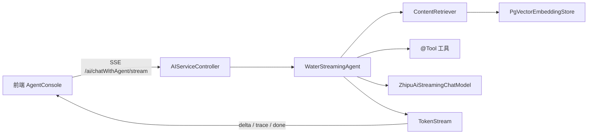

# 本项目 LangChain4j API 学习参考

本文以 `prediction-service` 中已经运行的代码为主线，说明每个 LangChain4j API 的职责、项目落点与最小用法。它不是完整 API 手册；需要查阅全部参数时，请跳转至文末官方文档。

## 1. 版本与依赖

本项目使用：

| 组件 | 版本 / 模块 | 用途 |
| --- | --- | --- |
| LangChain4j 核心 | `langchain4j 1.18.0` | `ChatModel`、AI Services、工具调用、流式输出与 RAG 抽象 |
| 智谱社区适配器 | `langchain4j-community-zhipu-ai 1.18.0-beta28` | GLM 聊天模型、`embedding-3` 嵌入模型 |
| PGVector 适配器 | `langchain4j-pgvector` | 向量持久化与相似度检索 |

版本由 `prediction-service/pom.xml` 中的 `langchain4j-bom` 与 `langchain4j-community-bom` 统一管理。不要在单个 LangChain4j 依赖上单独指定版本，否则容易出现核心 API 与社区适配器不兼容。

## 2. 本项目 Agent 调用链



非流式对话走 `WaterAgent`，使用 `ChatModel` 并通过 `AgentTraceContext` 返回完整 trace。流式对话走 `WaterStreamingAgent`，使用 `TokenStream` 将回答增量和 RAG/工具轨迹分别发送给前端。

## 3. 聊天模型：`ChatModel` 与 `StreamingChatModel`

对应文件：[ModelConfig.java](../src/main/java/com/ncwu/predictionservice/config/ModelConfig.java)。

### `ChatModel`

`ChatModel` 用于一次性拿到完整回答，适合预测数值、生成摘要以及非流式 Agent。

```java
ChatModel model = ZhipuAiChatModel.builder()
        .apiKey(System.getenv("API_KEY"))
        .model("glm-4-plus")
        .connectTimeout(Duration.ofSeconds(60))
        .readTimeout(Duration.ofSeconds(60))
        .build();

String answer = model.chat("根据最近七天用水量给出节水建议");
```

常用 API：

| API | 说明 | 项目示例 |
| --- | --- | --- |
| `ChatModel.chat(String)` | 发送单轮纯文本提示词 | `AiServiceImpl` 中的预测、建议与摘要 |
| `ChatModel.chat(ChatRequest)` | 发送结构化消息、请求级参数、工具规范 | 当前未直接使用，复杂控制时优先采用 |
| `ZhipuAiChatModel.builder()` | 创建智谱 GLM 非流式客户端 | `ModelConfig.initModel()` |

### `StreamingChatModel`

流式模型不会直接返回字符串，而是由 AI Services 包装为 `TokenStream`：

```java
StreamingChatModel model = ZhipuAiStreamingChatModel.builder()
        .apiKey(System.getenv("API_KEY"))
        .model("glm-4-plus")
        .toolStream(true)
        .build();
```

`toolStream(true)` 让模型在流式回答中也可完成工具调用；不要把流式结果当作一次性 `String` 处理。

## 4. AI Services：把 Java 接口变成 Agent

对应文件：[WaterAgent.java](../src/main/java/com/ncwu/predictionservice/agent/WaterAgent.java)、[WaterStreamingAgent.java](../src/main/java/com/ncwu/predictionservice/agent/WaterStreamingAgent.java)。

`AiServices.builder(接口.class)` 会为带注解的 Java 接口创建代理。接口方法的返回类型决定调用模式：`String` 为非流式，`TokenStream` 为流式。

```java
public interface CampusAgent {
    @SystemMessage("你是校园水务助手，只能依据检索和工具结果回答。")
    String chat(@MemoryId String conversationId, @UserMessage String input);
}

CampusAgent agent = AiServices.builder(CampusAgent.class)
        .chatModel(chatModel)
        .tools(waterQueryTools)
        .contentRetriever(contentRetriever)
        .chatMemoryProvider(memoryId -> MessageWindowChatMemory.withMaxMessages(20))
        .build();
```

| 注解 / API | 含义 | 本项目用法 |
| --- | --- | --- |
| `@SystemMessage` | 固定系统提示词 | 设备编码规则、回答边界 |
| `@UserMessage` | 标记用户输入参数 | `chat(..., String userInput)` |
| `@MemoryId` | 将请求绑定到一个记忆窗口 | 对话 ID；流式临时请求使用随机 ID |
| `AiServices.builder()` | 配置模型、工具、RAG 和记忆后生成 Agent | `ModelConfig` |
| `.afterToolExecution(...)` | 在非流式 Agent 中记录工具执行 | `AgentTraceContext` |

> 关键限制：只要接口方法使用了 `@MemoryId`，就必须调用 `.chatMemoryProvider(...)`。否则启动时会抛出 `IllegalConfigurationException`。本项目在 `local` profile 使用进程内窗口，在 `memory` profile 使用 Redis 存储。

## 5. 工具调用：`@Tool`

对应目录：[functionCalling](../src/main/java/com/ncwu/predictionservice/functionCalling)。

工具是普通 Java 方法，加上 `@Tool` 后由模型根据描述决定是否调用。工具的描述应写清楚：何时使用、参数含义、返回数据单位；不要依赖方法名让模型猜测。

```java
@Tool("查询指定校区最近七天的用水量，适用于用水趋势和预测问题")
public Result<ToAIBO> getRecentWeekUsage() {
    return iotDataServiceApi.getRecentWeekUsage();
}
```

在 Agent 构建时注册：

```java
AiServices.builder(WaterAgent.class)
        .tools(waterQueryTools, iotDeviceTools, repairTools, otherTools);
```

工具轨迹使用 `ToolExecution` 获取名称、结果、耗时和失败状态。项目将其裁剪后返回前端，避免将过长数据和内部细节直接暴露给页面。

## 6. RAG：嵌入、向量库与检索器

对应文件：[RagConfig.java](../src/main/java/com/ncwu/predictionservice/config/RagConfig.java)、[RagKnowledgeInitializer.java](../src/main/java/com/ncwu/predictionservice/rag/RagKnowledgeInitializer.java)。

### 6.1 `EmbeddingModel`

嵌入模型把文本转换为固定维度向量。本项目使用智谱 `embedding-3`，维度为 `1024`：

```java
EmbeddingModel embeddingModel = ZhipuAiEmbeddingModel.builder()
        .apiKey(apiKey)
        .model("embedding-3")
        .dimensions(1024)
        .build();
```

向量维度必须和 PGVector 表 / `PgVectorEmbeddingStore.dimension(...)` 一致。修改模型或维度后应重建向量表与知识索引。

### 6.2 `PgVectorEmbeddingStore<TextSegment>`

`EmbeddingStore` 负责保存向量并进行相似度搜索：

```java
EmbeddingStore<TextSegment> store = PgVectorEmbeddingStore.builder()
        .host("localhost")
        .port(5432)
        .database("campus_water")
        .user("campus_water")
        .password("campus_water")
        .table("rag_embeddings")
        .dimension(1024)
        .createTable(true)
        .build();
```

### 6.3 文档导入：`EmbeddingStoreIngestor`

启动时 `RagKnowledgeInitializer` 会通过 LangChain4j 的 `FileSystemDocumentLoader` 读取本地的 `src/main/resources/knowledge/*.md`；应用打包为 JAR 后自动切换为 `ClassPathDocumentLoader`，按 `800` token、`120` token 重叠切分，再写入 PGVector：

```java
DocumentSplitter splitter = DocumentSplitters.recursive(300, 50);
EmbeddingStoreIngestor.builder()
        .documentSplitter(splitter)
        .embeddingModel(embeddingModel)
        .embeddingStore(store)
        .build()
        .ingest(documents);
```

项目对所有知识文档内容计算 SHA-256。校验值不变时跳过导入，既避免启动时重复调用嵌入模型，也避免额外 API 消耗；校验值变化时先清空旧向量，防止已删除文档继续被召回。

### 6.4 检索：`EmbeddingStoreContentRetriever`

```java
ContentRetriever retriever = EmbeddingStoreContentRetriever.builder()
        .embeddingModel(embeddingModel)
        .embeddingStore(store)
        .maxResults(4)
        .minScore(0.65)
        .build();
```

| 参数 | 项目默认值 | 影响 |
| --- | ---: | --- |
| `maxResults` | `4` | 每个问题最多注入的知识片段数 |
| `minScore` | `0.65` | 相似度阈值；提高可降低无关知识，过高会导致无法命中 |
| `knowledgeLocation` | `classpath*:knowledge/*.md` | 参与索引的知识文件位置 |

通过 `ContentRetrieverListener` 可监听召回结果。本项目读取每个 `Content` 的 `source` 元数据与 `ContentMetadata.SCORE`，再通过 trace 返回“RAG 参考资料”。

## 7. 流式输出：`TokenStream`

对应文件：[AIServiceController.java](../src/main/java/com/ncwu/predictionservice/controller/AIServiceController.java)。

```java
TokenStream stream = waterStreamingAgent.chat(memoryId, input);
stream.onPartialResponse(token -> send(emitter, "delta", token))
        .onRetrieved(contents -> send(emitter, "trace", traceCollector.snapshot()))
        .onToolExecuted(execution -> send(emitter, "trace", traceCollector.snapshot()))
        .onCompleteResponse(response -> {
            send(emitter, "done", "");
            emitter.complete();
        })
        .onError(error -> emitter.completeWithError(error))
        .start();
```

| 回调 | 用途 |
| --- | --- |
| `onPartialResponse` | 逐 token / 分片返回模型文本 |
| `onRetrieved` | 检索完成后记录被引用的知识片段 |
| `onToolExecuted` | 工具调用结束后记录工具轨迹 |
| `onCompleteResponse` | 发送最终 trace、结束 SSE |
| `onError` | 向前端发送错误事件并关闭连接 |

前端必须保留 SSE `data:` 后除协议分隔空格外的原始空白字符。Markdown 标题、列表与代码块依赖换行或行首空格，使用 `trimStart()` 会破坏输出格式。

## 8. 会话记忆：`ChatMemoryProvider` 与 `ChatMemoryStore`

对应文件：[ModelConfig.java](../src/main/java/com/ncwu/predictionservice/config/ModelConfig.java)、[RedisChatMemoryStore.java](../src/main/java/com/ncwu/predictionservice/conversation/RedisChatMemoryStore.java)。

```java
builder.chatMemoryProvider(memoryId -> MessageWindowChatMemory.builder()
        .id(memoryId)
        .maxMessages(20)
        .chatMemoryStore(redisChatMemoryStore)
        .build());
```

| 类型 | 职责 | 本项目实现 |
| --- | --- | --- |
| `ChatMemoryProvider` | 按 `@MemoryId` 创建或取得一个记忆窗口 | `ModelConfig` 中的 Lambda |
| `MessageWindowChatMemory` | 只保留最近 N 条消息，控制上下文长度 | 最大 `20` 条 |
| `ChatMemoryStore` | 持久化记忆窗口消息 | `RedisChatMemoryStore` |

`memory` profile 会启用 `RedisChatMemoryStore`：Redis 保存带 TTL 的短期上下文窗口，`MessageWindowChatMemory` 负责窗口裁剪、系统消息和工具消息的一致性；Store 只读写完整 JSON。PostgreSQL 的 `agent_conversation.summary` 保存长期记忆信息，`agent_message` 保存供 UI 展示和生成摘要使用的完整历史；二者都不能替代 Redis 短期上下文。每轮回答完成后，记忆决策模型会评估新增消息：仅在包含长期价值的信息时更新摘要，否则返回 `NO_UPDATE` 并标记这些消息已评估。长期摘要通过 `systemMessageProvider` 注入，避免把完整历史无限放入模型上下文。

## 9. 本项目 API 与源码索引

| 学习主题 | 建议先读的文件 |
| --- | --- |
| 模型与 Agent 装配 | [ModelConfig.java](../src/main/java/com/ncwu/predictionservice/config/ModelConfig.java) |
| 系统提示词、`@SystemMessage`、`@MemoryId` | [WaterAgent.java](../src/main/java/com/ncwu/predictionservice/agent/WaterAgent.java) |
| 流式 Agent 与 `TokenStream` | [WaterStreamingAgent.java](../src/main/java/com/ncwu/predictionservice/agent/WaterStreamingAgent.java) |
| 工具描述与参数 | [functionCalling](../src/main/java/com/ncwu/predictionservice/functionCalling) |
| PGVector 与召回 trace | [RagConfig.java](../src/main/java/com/ncwu/predictionservice/config/RagConfig.java) |
| 文档切分、嵌入与重建 | [RagKnowledgeInitializer.java](../src/main/java/com/ncwu/predictionservice/rag/RagKnowledgeInitializer.java) |
| SSE 协议与 trace 事件 | [AIServiceController.java](../src/main/java/com/ncwu/predictionservice/controller/AIServiceController.java) |
| 前端消费流式结果 | [AgentConsole.tsx](../../frontend/src/pages/AgentConsole.tsx) |

## 10. 推荐学习顺序

1. 先理解 `ChatModel.chat(String)` 与 `ZhipuAiChatModel` 的最小调用。
2. 阅读 `WaterAgent`，再阅读 `ModelConfig` 的 `AiServices.builder(...)` 装配。
3. 学习 `@Tool`，尝试新增一个只读查询工具。
4. 学习 `EmbeddingStoreIngestor` 与 `EmbeddingStoreContentRetriever`，修改一篇 `knowledge/*.md` 后观察重新索引。
5. 最后阅读 `TokenStream`、`SseEmitter` 和前端 SSE 解析，理解 trace 如何实时呈现。

## 官方文档

- [LangChain4j 文档首页](https://docs.langchain4j.dev/)
- [聊天模型](https://docs.langchain4j.dev/tutorials/chat-and-language-models/)
- [AI Services](https://docs.langchain4j.dev/tutorials/ai-services/)
- [工具调用](https://docs.langchain4j.dev/tutorials/tools/)
- [RAG](https://docs.langchain4j.dev/tutorials/rag/)
- [聊天记忆](https://docs.langchain4j.dev/tutorials/chat-memory/)
- [PGVector 集成](https://docs.langchain4j.dev/integrations/embedding-stores/pgvector/)
- [智谱 AI 集成](https://docs.langchain4j.dev/integrations/language-models/zhipu-ai/)
